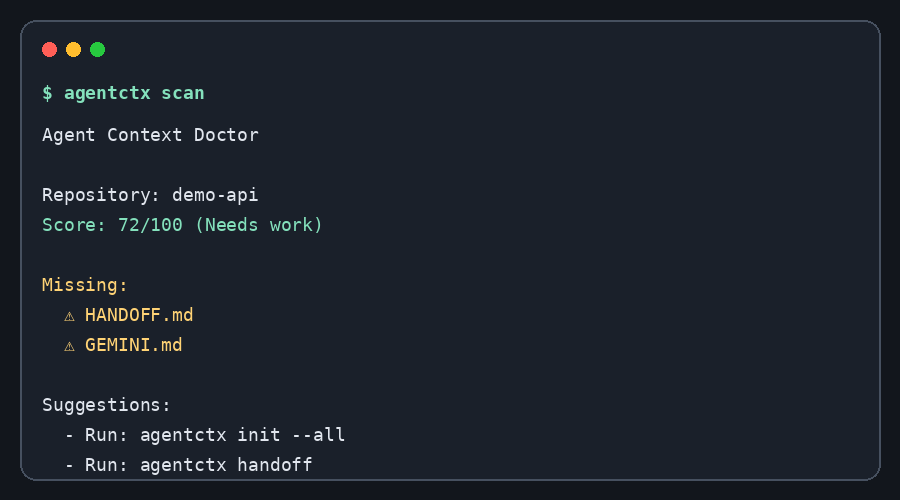

# Agent Context Doctor

<p align="center">
  <b>One CLI to keep all your AI agent context files in sync.</b><br>
  <sub>Zero dependencies · Works offline · No API key needed</sub>
</p>

<p align="center">
  <a href="https://pypi.org/project/agent-context-doctor/">
    
  </a>
  <a href="https://pypi.org/project/agent-context-doctor/">
    
  </a>
  <a href="https://github.com/lamguo/agent-context-doctor/blob/master/LICENSE">
    
  </a>
  <a href="https://github.com/lamguo/agent-context-doctor/actions/workflows/ci.yml">
    
  </a>
  <a href="https://github.com/lamguo/agent-context-doctor">
    
  </a>
  
  
</p>

Audit, generate, sync, verify, and package repository context files for AI coding agents.

`agentctx` helps you keep project instructions accurate across tools such as Codex, Claude Code, Gemini CLI, Cursor, and GitHub Copilot. It works locally, uses no LLM API, and has zero runtime dependencies.



## Why?

AI coding agents work better when your repository has clear, current, and tool-readable instructions. Many projects now carry several context files:

- `AGENTS.md`
- `CLAUDE.md`
- `GEMINI.md`
- `.github/copilot-instructions.md`
- `.cursor/rules/`
- `HANDOFF.md`

Keeping those files synchronized by hand is easy to forget. Agent Context Doctor scans your repository, reports missing or stale context, generates starter files, safely syncs generated sections, verifies context health in CI, and creates handoff/context packs for the next AI coding session.

## Features

- **Scan repository context** with a readable score and machine-readable JSON.
- **Verify in CI** with a clear pass/fail command separate from human reports.
- **Generate starter files** for AGENTS.md, Claude, Gemini, Copilot, Cursor, and handoff notes.
- **Safely sync generated sections** without deleting user-written content outside markers, including Cursor rules.
- **Create handoff summaries** from local Git state.
- **Package AI-ready context** into `PROJECT_CONTEXT.md` or print it with `--stdout`.
- **Generate score badges** for README files.
- **Run safe repairs** with `agentctx doctor --fix`.
- **Zero runtime dependencies**; Python standard library only.

| Command | What it does |
|---|---|
| `agentctx scan` | 🏥 Score your repo's AI context health (0–100) |
| `agentctx verify` | ✅ CI-friendly pass/fail gate (`--min-score`, `--strict`) |
| `agentctx init` | 📋 Generate AGENTS.md, HANDOFF.md & all tool context files |
| `agentctx sync` | 🔄 Propagate AGENTS.md updates across CLAUDE.md, GEMINI.md, Copilot, Cursor |
| `agentctx doctor --fix` | 🩺 Auto-repair all missing/outdated context in one command |
| `agentctx handoff` | 📝 Session handoff summary from local Git state |
| `agentctx pack` | 📦 Bundle everything into `PROJECT_CONTEXT.md` or `--stdout` |
| `agentctx badge` | 🏅 Generate a score badge for your README |

## Installation

From PyPI, once published:

```bash
pip install agent-context-doctor
```

From source:

```bash
git clone https://github.com/lamguo/agent-context-doctor.git
cd agent-context-doctor
python -m pip install -e .
```

## Quick start

```bash
# Audit the current repository for humans
agentctx scan

# JSON output for scripts
agentctx scan --json

# CI-friendly verification
agentctx verify --min-score 90
agentctx verify --strict

# Generate AGENTS.md and HANDOFF.md if missing
agentctx init

# Generate all supported context files
agentctx init --all

# Sync AGENTS.md into Claude, Gemini, Copilot, and Cursor instruction files
agentctx sync --from AGENTS.md

# Check whether generated files are in sync
agentctx sync --check

# Generate a handoff file from local Git state
agentctx handoff

# Generate PROJECT_CONTEXT.md for a new AI coding session
agentctx pack

# Print the context pack instead of writing it
agentctx pack --stdout

# Generate a README badge
agentctx badge

# Plan/apply safe context repairs
agentctx doctor
agentctx doctor --fix
```

## Example scan output

```text
Agent Context Doctor

Repository: my-project
Score: 82/100 (Good)

Found:
  ✅ README.md
  ✅ AGENTS.md
  ✅ tests/

Missing:
  ⚠️ HANDOFF.md
  ⚠️ GEMINI.md

Problems:
  ⚠️ Missing HANDOFF.md. Long AI coding sessions are easier to resume with a handoff file.
  ⚠️ Missing GEMINI.md.

Suggestions:
  - Run: agentctx init --all
  - Run: agentctx handoff
```

## Commands

### `agentctx scan`

Checks common AI context files, project files, referenced local paths, common project commands, command/config mismatches, AGENTS.md quality sections, and sync markers. It is meant for human-readable reporting and returns zero by default unless `--fail-under` is used.

```bash
agentctx scan
agentctx scan --json
agentctx scan --fail-under 80
agentctx scan --root /path/to/repo
```

### `agentctx verify`

Runs a CI-friendly verification gate. Unlike `scan`, this command is intentionally pass/fail.

```bash
agentctx verify
agentctx verify --min-score 90
agentctx verify --strict
agentctx verify --json
```

### `agentctx init`

Creates starter templates. Existing files are skipped by default.

```bash
agentctx init
agentctx init --all
agentctx init --dry-run
agentctx init --force
```

### `agentctx sync`

Copies `AGENTS.md` into generated sections in tool-specific files. It only replaces content between `agentctx` markers.

```bash
agentctx sync --from AGENTS.md
agentctx sync --to claude --to gemini
agentctx sync --to cursor
agentctx sync --dry-run
agentctx sync --check
```

### `agentctx handoff`

Creates a handoff file using local Git metadata.

```bash
agentctx handoff
agentctx handoff --json
agentctx handoff --output HANDOFF.md
```

### `agentctx pack`

Creates an AI-ready context package.

```bash
agentctx pack
agentctx pack --output PROJECT_CONTEXT.md
agentctx pack --stdout
```

### `agentctx badge`

Prints a dynamic Markdown badge based on the current context score.

```bash
agentctx badge
agentctx badge --style flat-square
agentctx badge --url-only
agentctx badge --json
```

### `agentctx doctor`

Plans or applies safe automatic repairs. Safe repairs can create missing starter files, generate `HANDOFF.md`, and create or refresh generated tool files from `AGENTS.md`. It does not delete files or overwrite user-authored content outside `agentctx` markers.

```bash
agentctx doctor
agentctx doctor --fix
agentctx doctor --json
```

## Generated file safety

`agentctx sync` uses markers like this:

```md
<!-- agentctx:source AGENTS.md -->
<!-- agentctx:hash abc123 -->
<!-- agentctx:begin -->
Generated content here.
<!-- agentctx:end -->
```

On later syncs, only the generated block is replaced. Content before or after the markers is preserved.

## CI usage

```yaml
name: CI

on:
  push:
  pull_request:
  workflow_dispatch:

jobs:
  context:
    runs-on: ubuntu-latest
    steps:
      - uses: actions/checkout@v4
      - uses: actions/setup-python@v5
        with:
          python-version: "3.12"
      - run: python -m pip install -e .
      - run: agentctx verify --min-score 90
      - run: agentctx sync --check
```

## GitHub setup

After creating the GitHub repository, set the default branch and Topics in the GitHub UI. See [`docs/github-setup.md`](docs/github-setup.md).

Recommended Topics:

```text
ai, coding-agents, agents-md, claude-code, gemini-cli, github-copilot, cursor, developer-tools, cli, python
```

## Development

```bash
python -m pip install -e .[dev]
pytest
agentctx scan
agentctx verify --min-score 90
```

## Roadmap

- More stale-path and command validation rules.
- Markdown table output option.
- Optional GitHub Action wrapper.
- Config file support for custom scoring thresholds.

## Contributing

See [`CONTRIBUTING.md`](CONTRIBUTING.md).

## 💖 Support

If Agent Context Doctor saves you time, consider supporting the project:

<p align="center">
  <a href="https://paypal.me/lamguo">
    
  </a>
</p>

<p align="center">
  
  <br>
  <sub>微信赞赏码</sub>
</p>

## License

MIT
